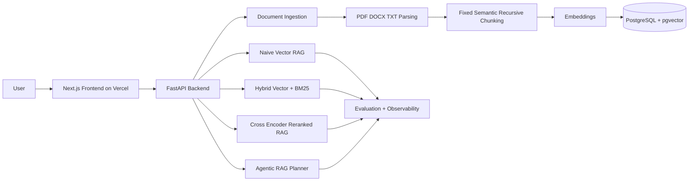

# RAG Battle Arena

RAG Battle Arena is an enterprise-style AI observability and evaluation platform for comparing Retrieval-Augmented Generation pipelines side-by-side. It is designed to show how retrieval architecture choices change answer quality, evidence selection, latency, cost, hallucination risk, and explainability.

This is not a tutorial chatbot. It is a production-oriented portfolio system for demonstrating serious RAG engineering depth.
\n
## What It Demonstrates

- Four independent RAG architectures answering the same question.
- Document ingestion with parsing, chunking, embeddings, and indexing stages.
- Chunk-level evidence inspection with similarity, BM25, and reranking scores.
- Reranking explainability from initial retrieval to final context.
- Evaluation metrics for relevance, faithfulness, groundedness, precision, recall, and risk control.
- Observability for latency, token usage, estimated cost, cache hit rate, and timing breakdowns.
- A premium dark-mode command-center UI built for technical recruiters and AI engineering leaders.

## Product Surface

### Arena
Upload documents, run a query, and compare Naive Vector RAG, Hybrid Search RAG, Reranked RAG, and Agentic RAG in a four-column battle view.

### Retrieval Lab
Inspect chunk movement across retrieval stages, similarity scores, BM25 contribution, reranker rank deltas, and final context selection.

### Evaluation
Compare relevance, faithfulness, groundedness, precision, recall, and hallucination-risk control with radar and bar charts.

### Observability
Track p95 latency, average latency, token consumption, estimated cost, retrieval timing, embedding timing, reranking timing, generation timing, cache hits, and chunk count.

### Architecture
Animated diagrams explain ingestion, retrieval, reranking, and agentic planning flows.

## Architecture



## RAG Pipelines

| Pipeline | Strategy | Best For | Tradeoff |
| --- | --- | --- | --- |
| Naive Vector RAG | Dense embedding similarity over chunks | Fast semantic recall | Can miss exact terms and entities |
| Hybrid Search RAG | Vector + BM25 with reciprocal rank fusion | Balanced semantic and lexical retrieval | Slightly more latency |
| Reranked RAG | Broad retrieval followed by cross-encoder reranking | High groundedness and precision | More compute and latency |
| Agentic RAG | Query rewriting, planning, retries, confidence checks | Ambiguous or multi-intent questions | Highest orchestration cost |

## API Surface

| Endpoint | Method | Purpose |
| --- | --- | --- |
| `/upload` | POST | Upload PDF, DOCX, or TXT and ingest it into the corpus |
| `/query` | POST | Run a query through the comparison engine |
| `/compare` | POST | Compare all four RAG architectures |
| `/evaluate` | POST | Return evaluation scores and winner |
| `/metrics` | GET | Return observability snapshot |
| `/documents` | GET | List indexed documents |
| `/retrieval-debug` | POST | Inspect chunks, trace, prompt, timings, and citations for one pipeline |

## Repository Structure

```text
.
├── frontend/
│   ├── app/
│   ├── components/
│   ├── hooks/
│   ├── lib/
│   ├── services/
│   ├── store/
│   ├── styles/
│   └── types/
├── backend/
│   ├── api/
│   ├── evaluation/
│   ├── ingestion/
│   ├── observability/
│   ├── rag/
│   ├── reranker/
│   └── retrieval/
├── sample-data/
├── docker-compose.yml
├── Dockerfile
├── railway.toml
├── render.yaml
└── README.md
```

## Tech Stack

### Frontend
- Next.js
- TypeScript
- Tailwind CSS
- shadcn-style local primitives
- Framer Motion
- Zustand
- Recharts
- Lucide icons

### Backend
- FastAPI
- Python 3.11+
- LangChain-compatible provider boundaries
- OpenAI SDK ready
- PostgreSQL + pgvector ready
- Deterministic local embedding fallback
- BM25 lexical retrieval
- Cross-encoder-style reranking abstraction
- Docker support

## Local Development

### 1. Clone and configure

```bash
git clone https://github.com/mrisahoo1/RAG-Battle-Arena.git
cd RAG-Battle-Arena
cp .env.example .env
```

### 2. Run backend

```bash
cd backend
python -m venv .venv
. .venv/Scripts/activate  # Windows PowerShell: .venv\Scripts\Activate.ps1
pip install -r requirements.txt
uvicorn api.main:app --reload --port 8000
```

### 3. Run frontend

```bash
cd frontend
npm install
npm run dev
```

Open `http://localhost:3000`.

## Docker Compose

```bash
docker compose up --build
```

This starts:
- Frontend: `http://localhost:3000`
- Backend: `http://localhost:8000`
- PostgreSQL + pgvector: `localhost:5432`

## Optional Sample Dataset

The repo includes a fetcher for public PDFs that work well for RAG demos, including official AI risk material and RAG papers with figures.

```bash
python sample-data/fetch_sample_dataset.py
```

Downloaded files are stored under `sample-data/downloads/`, which is intentionally gitignored. Good sample documents include:

- NIST AI Risk Management Framework 1.0: `https://nvlpubs.nist.gov/nistpubs/ai/NIST.AI.100-1.pdf`
- Developing RAG-based LLM Systems from PDFs: `https://arxiv.org/pdf/2410.15944`
- VDocRAG over visually rich documents: `https://arxiv.org/pdf/2504.09795`
- Retrieval-Augmented Generation survey: `https://arxiv.org/pdf/2407.13193`

## Deployment

### Frontend on Vercel

Set this environment variable in Vercel after the backend is deployed:

```bash
NEXT_PUBLIC_API_BASE_URL=https://your-backend-url
```

Deploy from the `frontend/` directory.

```bash
cd frontend
vercel deploy -y
```

### Backend on Railway

Railway can deploy the root `Dockerfile`.

Required variables:

```bash
ENABLE_DEMO_MODE=true
OPENAI_API_KEY=
DATABASE_URL=postgresql://...
```

The included `railway.toml` sets the start command and health check.

### Backend on Render

Render can use `render.yaml` to create the Docker web service and PostgreSQL database. Add `OPENAI_API_KEY` only when you want real model calls.

## Environment Variables

| Variable | Purpose |
| --- | --- |
| `NEXT_PUBLIC_API_BASE_URL` | Frontend API base URL |
| `OPENAI_API_KEY` | Enables real OpenAI model calls when provider code is extended |
| `OPENAI_MODEL` | Chat model name |
| `OPENAI_EMBEDDING_MODEL` | Embedding model name |
| `DATABASE_URL` | PostgreSQL connection string |
| `VECTOR_TABLE` | pgvector table name |
| `ENABLE_DEMO_MODE` | Keeps deterministic local demo mode enabled |

## Production Notes

The demo engine is deterministic by design, so the public app works without paid model keys. The backend modules are separated around ingestion, retrieval, reranking, evaluation, and observability so production providers can be swapped in cleanly:

- Replace deterministic embeddings in `backend/retrieval/vector.py` with OpenAI or sentence-transformers embeddings.
- Persist chunks and vectors in PostgreSQL/pgvector instead of the in-memory corpus.
- Replace the reranking heuristic in `backend/reranker/cross_encoder.py` with a sentence-transformers cross encoder.
- Add LangSmith, OpenTelemetry, or vendor tracing inside `backend/observability/metrics.py`.

## Future Roadmap

- GraphRAG over entity and citation graphs.
- Multimodal RAG over tables, figures, screenshots, and scanned PDFs.
- MCP integration for live external tool retrieval.
- Agent memory for longitudinal evaluation sessions.
- Enterprise auth and workspace-level corpora.
- Full tracing with LangSmith and OpenTelemetry.
- Human feedback loops and dataset curation from failed retrievals.
- Offline batch evaluation against golden QA sets.

## Why Recruiters Should Care

This project demonstrates the actual engineering surface of production RAG systems: retrieval strategy tradeoffs, evidence inspection, reranking, evaluation, cost and latency observability, deployment separation, explainability, and operator-grade UI design.

